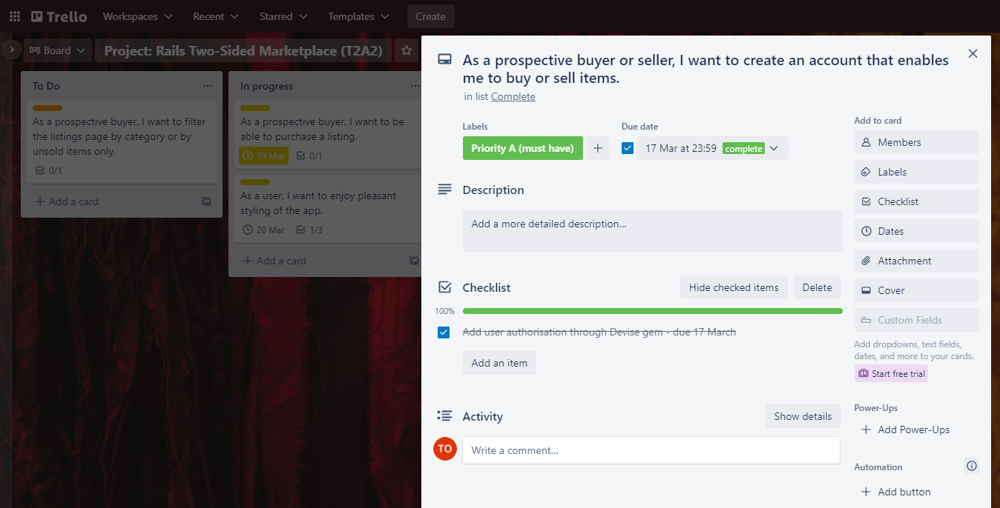

# Project: T2A2 - Rails Marketplace Web App - *Fridges For All*

## The problem
---

Our **target market** needs a simple way to: (1) sell their refrigerators; and (2) buy second-hand refrigerators.

Refrigerators (and freezers) are:
- Long-life goods and are inconveniently large to keep superfluously if they are not going to be used in a new location (e.g. upon moving into a house that possesses a refrigerator)
- Expensive new (larger-sized units typically retail for $1,000+)

Our **Target market** comprises individual consumers in Australia who live and move between rented residences (e.g. properties being leased variously with/without refrigerators; sharehouses that already possess a refrigerator / are losing a refrigerator with a departing housemate). For example, internationals living and working in Australia, students, and young part-time and full-time workers.

Our target market's demand is primarily met by three options at the present:
- Sellers of new appliances (e.g. appliancesonline.com.au) – consumers pay retail prices
- Company sellers of second-hand appliances (e.g. dmsappliances.com.au) – consumers pay company fees/commission to store, refurbish and resell their items
- Generalist marketplaces (e.g. Facebook Marketplace, Gumtree, eBay) – not category-specific marketplaces

Fridges For All tries to better meet this demand by operating as a category-specific online marketplace for buyers and sellers to transact directly (in the manner of bikeexchange.com.au or carsales.com.au).

Specificity of a marketplace provides consumers with clarity that they will reach prospective buyers/sellers of the particular type of good. Additionally, consumers do not need to pay the fees and commissions that companies charge to act as a third-party conduit between buyers and sellers.

Success for Fridges For All looks like becoming the ‘destination marketplace’ for second-hand refrigerators (and freezers).

If successful, Fridges For All could consider the potential of expanding to operate as a marketplace for second-hand white goods, as many other white goods share the same characteristics of refrigerators that give rise to this demand from our target market.

<br>

## Deployed App
---

https://fridges-for-all.herokuapp.com/

<br>

## GitHub repository
---

https://github.com/tigerob/project-rails-marketplace-app

<br>

## Description
---

### **Purpose**

Provide our **target market** with a simple way to: (1) sell their refrigerators; and (2) buy second-hand refrigerators, directly to/from other individual consumers.

### **Functionality**

Users are able to:
- Create an account
- View all listings
- Purchase any available listings by debit or credit card
- Create a new listing, including uploading a photo for their listing
- Edit any of their existing listings
- Delete any of their listings

### **Sitemap**


### **Screenshots**

The following screenshots provide samples of the app.


### **Target audience**

As outlined under 'The Problem', above, our target market comprises individual consumers in Australia who live and move between rented residences (e.g. properties being leased variously with/without refrigerators; sharehouses that already possess a refrigerator / are losing a refrigerator with a departing housemate). For example, internationals living and working in Australia, students, and young part-time and full-time workers.

### **Tech stack**

- Ruby 2.7.5
- Rails 6.1.4.6
- PostgreSQL 12.9
- SCSS
- Bootstrap 4
- Heroku
- Amazon S3
- Stripe
- Ultrahook

<br>

## User stories
---

1. As a user, I want to visit the home page of the app and navigate the app through a navigation bar.
2. As a prospective buyer or seller, I want to create an account that enables me to buy or sell items.
3. As a prospective buyer, I want to view all listings.
4. As a prospective buyer, I want to click on individual listings and see that listing's information.
5. As a prospective buyer, I want to be able to purchase a listing.
6. As a prospective seller, I want to create a listing for my item and be able to edit or delete my listing.

<br>

## Wireframes
---


<br>

## ERD


<br>

## High-level components of app
---

As a Rails app, this app uses MVC (Model View Controller) architecture. This
architecture is characterised by dividing code into three main parts (models, views and controllers) that each serve a separate function and which, together, cohere to form a whole working app.

### **Models**

Models are responsible for managing the data in the app. That is, all information retained in the app’s continuous storage and used within the app. For example, all user account details and listings of fridges are stored as data.

The app's models connect to the app's PostgreSQL database to create, retrieve, modify or delete app data. They achieve this by using Active Record, the Rails ORMS (object-relational mapping system) that connects the objects of the app to tables in the PostgreSQL database. Active Record provides a rich API for accessing data within the database more simply that writing SQL statements directly and, by virtue of being the built-in ORMS, with less overall database access code (Rails Guides - Active Record Basics 2022).

The app's models avail Active Record by each inheriting Active Record behaviours from the ApplicationRecord class that is generated by Rails and which, in turn, accesses ActiveRecord::Base (the Base class in the ActiveRecord module) (e.g. ```listing < ApplicationRecord```).

The app's models are also responsible for validating input from the user to update data through Active Record Validations (e.g. the Listing model validates that all records in the Listings table must have a title and that this title can only be a maximum of 50 characters).

Additionally, the app's models define the data structure and the relationships between the different types of data in the app through Active Record Associations (see 'Models', below, for further detail).

### **Views**

Views are responsible for everything the user sees and with which the user interacts; for instance, the display of listings and edit/delete/buy buttons. The app data for a view is given to that view by its controller. The view prepares the HTML that will be sent back to the user’s browser upon request by using a number of view files, which are written in ERB (a templating language that contains HTML with Ruby code embedded within it).

ERB allows for dymamic access to the data provided by the relevant controller (e.g. ```@listings = Listing.all```) through use of Ruby methods (e.g. ```@listings.each```). Additionally, pieces of code can be extracted into 'partials' that can then be used any number of times throughout the app's views (e.g. ```<%=render "form"%>``` renders the 'form' partial).

### **Controllers**

The app's controllers are responsible for interacting with their views and model to perform various actions between them. A view will indicate to the controller, by the URL, a requested action. The controller will instigate that action with the relevant model. The model will do as instructed – e.g. read the database – and then return that data to the controller. Finally, the controller will pass that data to the relevant view to display to the user.

The app's controllers achieve this by each inheriting behaviours from the ApplicationController class that is generated by Rails and which, in turn, accesses ActionController::Base (the Base class in the ActionController module) (e.g. ```ListingsController < ApplicationController```). Important behaviours include how to handle client HTTP requests and how to extract request parameters.

<br>

## Third-party services
---

### **Amazon S3**

Amazon S3 is an object-storage service provided by Amazon Web Services. It offers storage and protection of objects, along with various storage-management features.

Fridges For All utilises Amazon S3 to give users a way of uploading an image as part of the 'create listing' and 'edit listing' features. All images that users upload are stored as objects in a dedicated Fridges For All bucket with Amazon S3.

The administrator of Fridges For All has access to management of this bucket through Amazon's AWS Management Console.

### **Stripe**

Stripe is a payment-processing service. It offers an API that allows web apps to accept payment securely through Stripe. Stripe provides both payment services (to accept payment) and payment gateway-services (to validate credit-card details and adequate funds).

Fridges For All utilises Stripe to give users a way to purchase listings by debit or credit card. All payments made on the app are handled by the Fridges For All Stripe account that is securely linked to the app.

The administrator of Fridges For All has access to the Fridges For All Stripe account through the Stripe dashboard.

### **Ultrahook**

Ultrahook is service that provides a way for web apps to securely receive webhooks (HTTP requests made when certain events are triggered within the app) behind a firewall. It achieves this by providing clients with a persistent public endpoint that has permission to pass on all webhooks received to the client's app.

Fridges For All utilises Ultrahooks to securely receive webhooks made in response to the successful completion of a Stripe payment event. This allows Fridges For All to receive confirmation of a successful payment and, consequently, notify users and update its databases to reflect all changes (e.g. the sold status of a listing).

<br>

## Models
---

Further to the detail given on the app's models in 'Models' under 'High-level components of app', above, the app possesses the following models and Active Record Associations (connections between two Active Record models):

1. Category (defined in category.rb)
   - ```has_many``` listings - i.e. each instance of the Category model has zero or more instances of the Listing model
2. Feature (defined in feature.rb)
   - ```has_many``` listings_features - i.e. each instance of the Feature model has zero or more instances of the Listings_feature model
   - ```has_many``` listings through listings_features - i.e. each instance of the Feature model has zero or more instances of the Listing model through the Listings_feature (join table) model
3. Listing (defined in listing.rb)
   - ```belongs_to``` user - i.e. each instance of the Listing model belongs to one instance of the User model
   - ```belongs_to``` category - i.e. each instance of the Listing model belongs to one instance of the Category model
   - ```has_many``` listings_features - i.e. each instance of the Listing model has zero or more instances of the Listings_feature (join table) model
   - ```has_many``` features through listings_features - i.e. each instance of the Listing model has zero or more instances of the Feature model through the Listings_feature (join table) model
   - ```has_one_attached``` photo - i.e. each instance of the Listing model has zero or one photo
4. Listings_feature (defined in listings_feature.rb)
   - ```belongs_to``` listing - i.e. each instance of the Listings_feature model belongs to one instance of the Listing model
   - ```belongs_to``` feature - i.e. each instance of the Listings_feature model belongs to one instance of the Feature model
5. Purchase (defined in purchase.rb)
   - ```belongs_to``` listing - i.e. each instance of the Purchase model belongs to one instance of the Listing model
   - ```belongs_to``` buyer user - i.e. each instance of the Purchase model belongs to one instance of the User model that represents the buying user
   - ```belongs_to``` seller user - i.e. each instance of the Purchase model belongs to one instance of the User model that represents the selling user
6. User (defined in user.rb)
   - ```has_many``` listings - i.e. each instance of the User model has zero or more instances of the Listing model
   - ```has_many``` bought purchases - i.e. each instance of the User model has zero or more instances of the Purchase model that represents bought items
   - ```has_many``` sold purchases - i.e. each instance of the User model has zero or more instances of the Purchase model that represents sold items

<br>

## Database relations
---

The tables within the app's database reflect the illustration provided by the ERD, above. In particular, each record within each table in the database is unique and possesses a unique primary key (PK).

Where a table possesses a foreign key (FK), this foreign key references the unique primary key of the relevant table. For example, the ```user_id``` foreign key in the Listings table references the individual record (by the primary key of that record) in the Users table that represents the user who created that listing.

<br>

## Database schema design
---

The schema for the app's database is included below.

This schema is contained within the schema.rb file of the app. It contains the code that generates the tables required in the database (via the ```create_table``` method). It exactly reflects the ERD and database relations outlined in 'ERD" and 'Database relations', above (with the addition of standard 'created_at', 'updated_at', and indexes).

For instance, the ```create_table``` method creates the Listings table with, amongst other things, a foreign key for ```user_id```. This foreign key references the table generated by the ```create_table``` method that creates the Users table.

```
ActiveRecord::Schema.define(version: 2022_03_15_095305) do

  # These are extensions that must be enabled in order to support this database
  enable_extension "plpgsql"

  create_table "active_storage_attachments", force: :cascade do |t|
    t.string "name", null: false
    t.string "record_type", null: false
    t.bigint "record_id", null: false
    t.bigint "blob_id", null: false
    t.datetime "created_at", null: false
    t.index ["blob_id"], name: "index_active_storage_attachments_on_blob_id"
    t.index ["record_type", "record_id", "name", "blob_id"], name: "index_active_storage_attachments_uniqueness", unique: true
  end

  create_table "active_storage_blobs", force: :cascade do |t|
    t.string "key", null: false
    t.string "filename", null: false
    t.string "content_type"
    t.text "metadata"
    t.string "service_name", null: false
    t.bigint "byte_size", null: false
    t.string "checksum", null: false
    t.datetime "created_at", null: false
    t.index ["key"], name: "index_active_storage_blobs_on_key", unique: true
  end

  create_table "active_storage_variant_records", force: :cascade do |t|
    t.bigint "blob_id", null: false
    t.string "variation_digest", null: false
    t.index ["blob_id", "variation_digest"], name: "index_active_storage_variant_records_uniqueness", unique: true
  end

  create_table "categories", force: :cascade do |t|
    t.string "name"
    t.datetime "created_at", precision: 6, null: false
    t.datetime "updated_at", precision: 6, null: false
  end

  create_table "features", force: :cascade do |t|
    t.string "name"
    t.datetime "created_at", precision: 6, null: false
    t.datetime "updated_at", precision: 6, null: false
  end

  create_table "listings", force: :cascade do |t|
    t.string "title"
    t.string "description"
    t.integer "price"
    t.integer "condition"
    t.integer "postcode"
    t.string "brand"
    t.string "model"
    t.string "finish"
    t.integer "capacity"
    t.integer "height"
    t.integer "width"
    t.integer "depth"
    t.integer "energy_efficiency"
    t.boolean "sold", default: false
    t.bigint "user_id", null: false
    t.bigint "category_id", null: false
    t.datetime "created_at", precision: 6, null: false
    t.datetime "updated_at", precision: 6, null: false
    t.index ["category_id"], name: "index_listings_on_category_id"
    t.index ["user_id"], name: "index_listings_on_user_id"
  end

  create_table "listings_features", force: :cascade do |t|
    t.bigint "listing_id", null: false
    t.bigint "feature_id", null: false
    t.datetime "created_at", precision: 6, null: false
    t.datetime "updated_at", precision: 6, null: false
    t.index ["feature_id"], name: "index_listings_features_on_feature_id"
    t.index ["listing_id"], name: "index_listings_features_on_listing_id"
  end

  create_table "purchases", force: :cascade do |t|
    t.bigint "listing_id", null: false
    t.bigint "buyer_id", null: false
    t.bigint "seller_id", null: false
    t.string "payment_id"
    t.string "receipt_url"
    t.datetime "created_at", precision: 6, null: false
    t.datetime "updated_at", precision: 6, null: false
    t.index ["buyer_id"], name: "index_purchases_on_buyer_id"
    t.index ["listing_id"], name: "index_purchases_on_listing_id"
    t.index ["seller_id"], name: "index_purchases_on_seller_id"
  end

  create_table "users", force: :cascade do |t|
    t.string "email", default: "", null: false
    t.string "encrypted_password", default: "", null: false
    t.string "reset_password_token"
    t.datetime "reset_password_sent_at"
    t.datetime "remember_created_at"
    t.datetime "created_at", precision: 6, null: false
    t.datetime "updated_at", precision: 6, null: false
    t.index ["email"], name: "index_users_on_email", unique: true
    t.index ["reset_password_token"], name: "index_users_on_reset_password_token", unique: true
  end

  add_foreign_key "active_storage_attachments", "active_storage_blobs", column: "blob_id"
  add_foreign_key "active_storage_variant_records", "active_storage_blobs", column: "blob_id"
  add_foreign_key "listings", "categories"
  add_foreign_key "listings", "users"
  add_foreign_key "listings_features", "features"
  add_foreign_key "listings_features", "listings"
  add_foreign_key "purchases", "listings"
  add_foreign_key "purchases", "users", column: "buyer_id"
  add_foreign_key "purchases", "users", column: "seller_id"
end
```

<br>

## Project management
---

[This](https://trello.com/b/ssDSaCCI/project-rails-two-sided-marketplace-t2a2) Trello board governed the planning and tracking of the tasks comprising this project.

Each task required to build the app was described in an individual card on this Trello board in the form of a user story. Each card was allocated a priority level and divided into sub-tasks (expressed as a checklist). This Trello board also utilised due dates for each sub-task (and therefore task) in order to timebox the development of the app.

The following screenshots provide samples of the Trello board.





